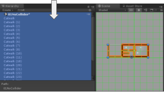
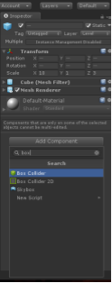

# Play to Learn!
Intro to Unity® Game Development

## Digital Media Lab Quick Guide
This short guide will get you started with your project. For more information about this or with other digital media projects, visit [http://libguides.humboldt.edu/dml](http://libguides.humboldt.edu/dml).

## Description
This guide is intended for Unity® beginners. 

It will introduce a few Unity® concepts, and provide a starting point for game development in Unity®, using educational assets designed for this SkillShop.

Unity® is available for free download here: [https://store.unity.com/download](https://store.unity.com/download)

Unity® is also available on campus in the Digital Media Lab (L120), the Library computer lab (L121), and the Art 125 computer lab. You will need to setup an account but can use your HSU Google account.

## Part 1: Setup
+ Download and unzip the [PlayToLearn folder](http://bit.ly/playToLearn)
+ Launch Unity® 
+ Select the ‘Open’ option near the upper right. Open the PlayToLearn folder.

### Note: 
Depending on your version of Unity® and operating system, you may receive errors at this step. These can safely be ignored. Choose  “ok” or “cancel” as prompted -- whichever selection continues the opening process!

## Part 2: Unity® Editor 
The Editor is divided into several windows:

1. Project: Your content in folders, subfolders, files, etc.
2. Scene view: The currently open scene (game level).
3. Hierarchy: hierarchical view of content content in scene.
4. Game: preview of your game. Corresponds to the main camera in your scene.
5. Inspector: A detailed view of whatever is selected.

## Part 3: Making Stuff Happen
For the purposes of this SkillShop, several “broken” scenes have been prepared for you to fix. In your Project window, open SkillShop/Scenes/SkillShopSequence. Each of these scenes presents a different challenge.

### Scene 1: Add Box Colliders so the player won’t fall through the floor.
Select the objects named “Catwalk” in the Hierarchy. (try typing “cat” in the search bar!)

In the Inspector, click “Add Component” and type in “Box Collider”

### Scene 2: Let the player jump high enough!
+ Expand LaunchAbility attached to “Player”
+ Find “movement force”
+ Change the value to 30… or whatever you choose, at your own risk

### Scene 3: How would you change the red orbs to make them easier?
(Hint: relevant component  attached to “base” subobject of these orbs!)

## Part 4: Onward!
Congrats, you’re off to a good start… but games are complex! Explore these resources to learn more:
+ Unity® Manual [https://docs.unity3d.com/Manual](https://docs.unity3d.com/Manual)
+ Unity® Community Wiki [http://wiki.unity3d.com](http://wiki.unity3d.com)
+ Made With Unity® showcase [https://unity.com/madewith](https://unity.com/madewith)

---
For more info visit: [http://libguides.humboldt.edu/dml](http://libguides.humboldt.edu/dml) or email dml@humboldt.edu

This guide has an open [Creative Commons license](https://creativecommons.org/share-your-work/licensing-types-examples/). You can use, share, remix and repurpose this content as long as you attribute the author, Nate Spence [CC BY](https://creativecommons.org/licenses/by/4.0/), 2018. If you’re re-using this guide, we’d love to hear about your project- dml@humboldt.edu.

